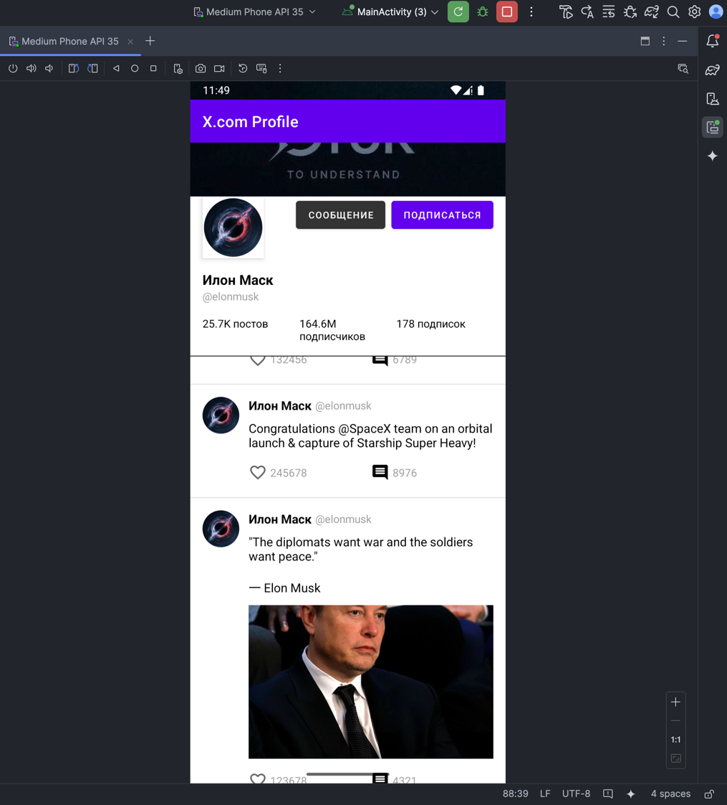

# **Лабораторная работа №1**  
**Тема:** Верстка и UI в Android  
**Цель:** Разработать экран профиля пользователя социальной сети с использованием XML-верстки и RecyclerView.  

---

## **1. Задание**  
Реализовать экран профиля пользователя, который включает:  

- **Аватар пользователя** (загружается из сети).  
- **Имя и никнейм**.  
- **Статистику профиля** (количество подписчиков, подписок, постов).  
- **Кнопки взаимодействия** ("Подписаться", "Написать сообщение").  
- **Список постов** (2-3 стабовых поста, заглушки вместо полноценной ленты), где:  
  - Есть текст поста.  
  - Если есть изображение — оно загружается из сети.  
  - Количество лайков и комментариев.  
  - Кнопки "Лайк" и "Комментировать" (с обработкой нажатий).  

### **Дополнительные требования:**  
✅ **Верстка через ConstraintLayout**.  
✅ Загрузка изображений с **Glide / Fresco / Coil**.  
✅ RecyclerView для списка постов (2-3 поста).  
✅ Оптимизация через `ViewHolder` и `DiffUtil`.  
✅ **Обработчики кликов** для кнопок (подписка, лайк, комментарий).  
✅ **Адаптивная верстка** (использование `match_parent`, `wrap_content`, `layout_weight`).  

---

## **2. Какие соцсети подойдут для примера?**  
Можно ориентироваться на дизайн следующих приложений:  
- **Instagram** – аватар, никнейм, статистика, посты с изображениями.  
- **Twitter** – список твитов, кнопки лайков и комментариев.  
- **VK** – профиль с подписчиками и лентой постов.  

Выберите одну соцсеть и постарайтесь повторить стиль ее профиля.  

---

## **3. Подготовка проекта**  

### **3.1. Добавление зависимостей**  
В `build.gradle.kts` добавьте библиотеки:  
```kotlin
dependencies {
    implementation("androidx.recyclerview:recyclerview:1.3.2")
    implementation("com.github.bumptech.glide:glide:4.16.0") // или Coil/Fresco
    implementation("androidx.constraintlayout:constraintlayout:2.1.4")
}
```

---

## **4. Полезные советы**  

### **4.1. Как добавить статичные иконки в приложение?**  
0. Найдите похожую на https://www.flaticon.com/  
1. Разместите PNG/SVG в `res/drawable/`.  
2. Используйте **Vector Asset** в Android Studio (`File → New → Vector Asset`).  
3. Вставьте иконку в XML:  
   ```xml
   <ImageView
       android:layout_width="24dp"
       android:layout_height="24dp"
       android:src="@drawable/ic_like"/>
   ```

---

### **4.2. Как понять отступы между элементами в другом приложении?**  
Чтобы измерить отступы в референсном дизайне (скриншот профиля), используйте:  
- https://www.rapidtables.com/web/tools/pixel-ruler.html

---

### **4.3. Как подобрать цвета?**  
- https://imagecolorpicker.com/  

---

## **6. Сдача работы**  
Приложить скриншот полученного экрана

💡 **Совет:** Делайте UI аккуратным, следите за отступами и используйте адаптивные размеры

## Результат

